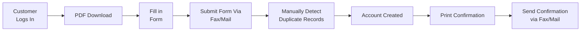
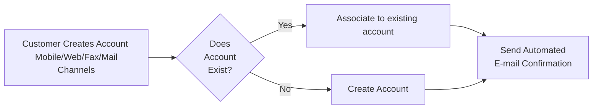
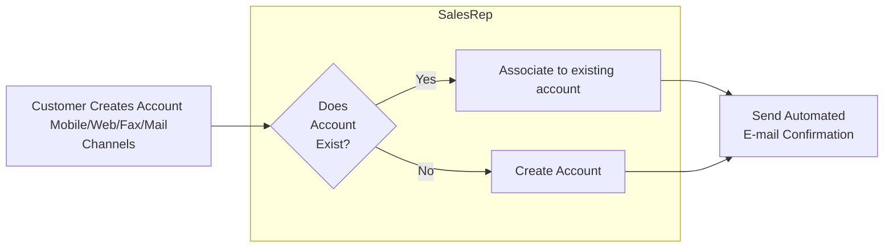

# Markdown-charts
markdown charts

# As-is Process Flow

```mermaid
flowchart LR
C[Customer </br> Logs In] --> P[PDF Download]
P --> F[Fill in </br> Form]
F --> S[Submit Form Via </br> Fax/Mail]
S --> M[Manually Detect </br> Duplicate Records]
M --> A[Account Created]
A --> R[Print Confirmation]
R -->N[Send Confirmation </br> via Fax/Mail]
```

# To-Be process design

```mermaid
flowchart LR
C[Customer Creates Account </br> Mobile/Web/Fax/Mail Channels] --> Exist{Does </br> Account <br/> Exist?}
Exist -->|Yes| A[Associate to existing account]
Exist -->|No| D[Create Account]
A --> E[Send Automated </br> E-mail Confirmation]
D --> E
```

# To-Be process design (with box)

```mermaid
flowchart LR
C[Customer Creates Account </br> Mobile/Web/Fax/Mail Channels] --> Exist
subgraph SalesRep
Exist{Does </br> Account <br/> Exist?}
Exist -->|Yes| A[Associate to existing account]
Exist -->|No| D[Create Account]
end
A --> E[Send Automated </br> E-mail Confirmation]
D --> E
```
