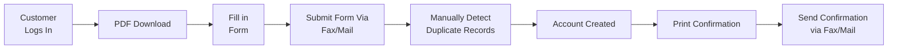

# Markdown-charts
markdown charts

```mermaid
flowchart LR
C[Customer </br> Logs In] --> P[PDF Download]
P --> F[Fill in </br> Form]
F --> S[Submit Form Via </br> Fax/Mail]
S --> M[Manually Detect </br> Duplicate Records]
M --> A[Account Created]
A --> R[Print Confirmation]
R -->N[Send Confirmation </br> via Fax/Mail]
```
